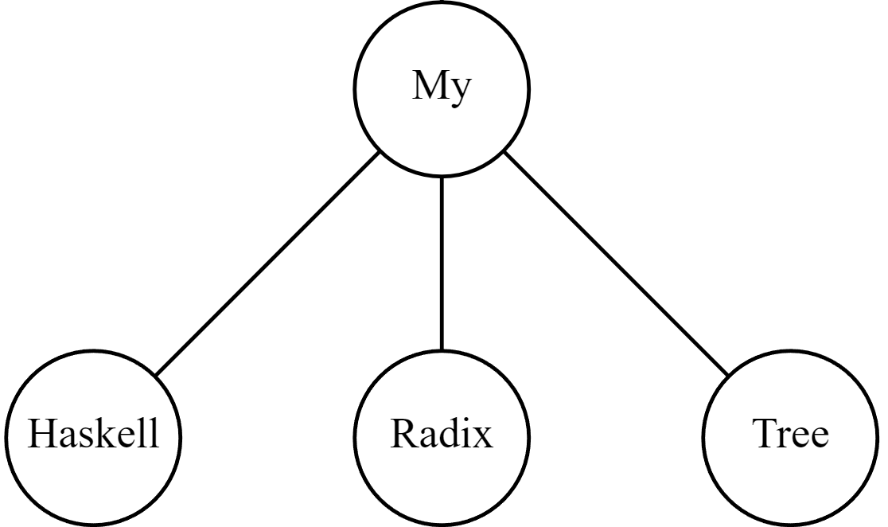
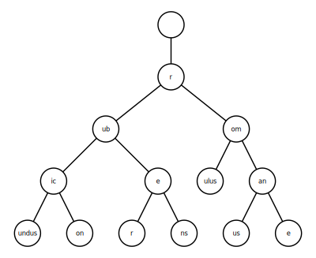
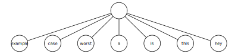

<p align="center">
	
</p>

# Haskell Radix

This project implements a basic Radix Tree with support for strings. It can also generate an svg of the tree. I used the `diagram` haskell library.

I used haskell's `stack` to setup the project.

## What's a Radix Tree?


The wikipedia [article](https://en.wikipedia.org/wiki/Radix_tree).

A Radix Tree is a datastructure that provides faster lookup times for string or string-like data.
It's based on the idea that words sharing the same prefix can be stored under the same "branch". This makes it faster to look them up by reducing the search space to only the branches that share a prefix with the searched word.

A Radix Tree can perform the same way as a list if none of the inserted words share a prefix, but in most cases it would do better.

They are often used in routers, to make routing tables faster. This works because IP's can also share prefixes.

## Usage

Import the Radix tree with: 
```haskell
import Radix ( addWord, deleteWord, searchWord, createTree, printTree )
```

Create your first tree with:
```haskell
let t = createTree
```

Then create add your first words with:
```haskell
let t2 = addWord t "romane"
let t3 = addWord t "rubicon"
```

Delete a word with:
```haskell
let t4 = deleteWord t3 ["rubicon"]
```

Search for a word with:
```haskell
let word = searchWord deletedT "rubicon"
```

## Examples

The wikipedia example tree using my implementation:


A worst case example:
